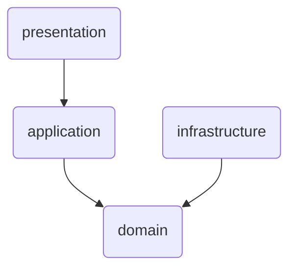
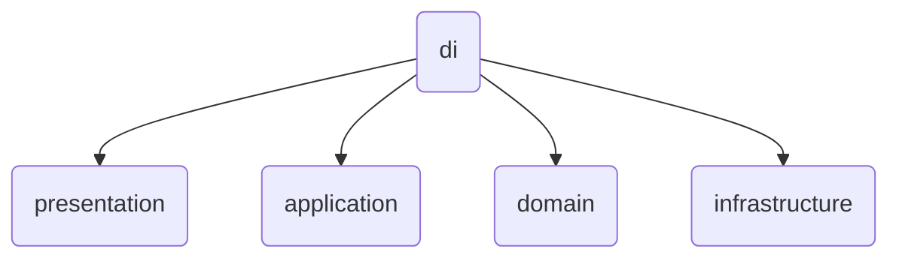

# peekr-server

## 1. Project Structure (Layered)
```
project/
│
├── presentation/            # 프레젠테이션 계층
│   ├── controller/          # API 엔드포인트 정의
│   ├── route/               # 라우팅 정의
│   ├── dto/                 # 요청/응답 DTO
│   ├── exception/           # 프레젠테이션 공통 예외 및 핸들러
│   ├── plugin/              # 미들웨어 역할 (Ex. 인증, 로깅, CORS 등)
│   ├── util/                # 프레젠테이션 유틸
│
│
├── application/             # 애플리케이션 계층
│   ├── usecase/             # 유스케이스 클래스들
│   ├── dto/                 # 유스케이스 입력/출력 DTO (도메인 전용 DTO)
│   ├── service/             # 도매인 조합 흐름 관리 (optional)
│   ├── mapper/              # DTO <-> 도메인 매핑
│   ├── exception/           # 유스케이스 공통 예외 및 핸들러
│
│
├── domain/                  # 핵심 도메인 계층
│   ├── model/               # 도메인 모델
│   │   ├── entity/          # 엔티티 클래스 (Ex. User.kt)
│   │   ├── value/           # 값 객체 (Ex. Email.kt, Password.kt)
│   │   ├── aggregate/       # Aggregate Root 객체
│   ├── repository/          # 리포지토리 인터페이스
│   ├── service/             # 도메인 서비스 (여러 엔티티에 걸친 복잡한 로직)
│   └── event/               # 도메인 이벤트 (optional)
│
│
├── infrastructure/          # 인프라스트럭처 계층
│   ├── persistence/         # ORM 기반 DB Entity (Ex. Exposed 등)
│   ├── repository-impl/     # 리포지토리 구현체
│   ├── service-impl/        # 외부 API 클라이언트 구현체
│   ├── mapper/              # 엔티티 <-> 도메인 매핑
│   └── util/                # 인프라 유틸 (Ex. DB 커넥터, Parser 등)
│
│
├── di/                      # 의존성 주입 설정
```

## 2. Project Structure Description
### Presentation Layer
사용자의 요청/응답을 처리하는 입구 계층
- HTTP 요청/응답 처리
- DTO 검증 등
### Application Layer
유스케이스를 조합하고 실행하는 계층
- 유스케이스 단위 로직
- 트랜잭션 단위 설정
- 도메인 객체 생성/조합
- 리포지토리, 도메인 서비스 호출
- 외부 서비스 호출 조율 등
### Domain Layer
핵심 비즈니스 로직, 규칙, 개념을 담은 순수 계층
- 비즈니스 규칙 정의
- Entity / Value Object / Service 간 협력
- 순수 Kotlin 코드
- 핵심 모델 정의 등
### Infrastructure Layer
DB, 외부 API, 시스템 연동 등 기술 세부 구현 담당 계층
- DB 영속성 구현
- 외부 API 연동
- 메일, 메시지, Kafka 등 연동
- 도메인 인터페이스의 구현체 제공 등

## 3. Dependency Direction
### Project

### DI
