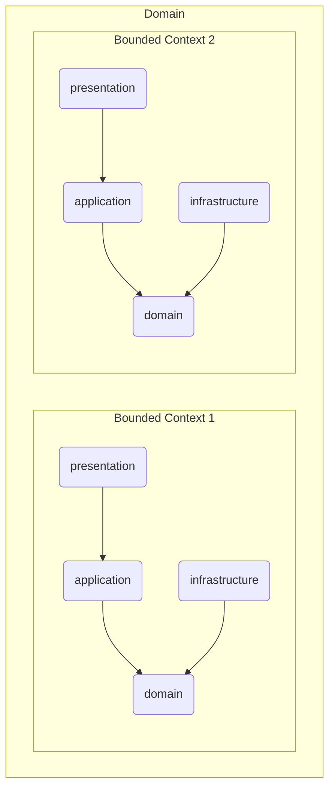
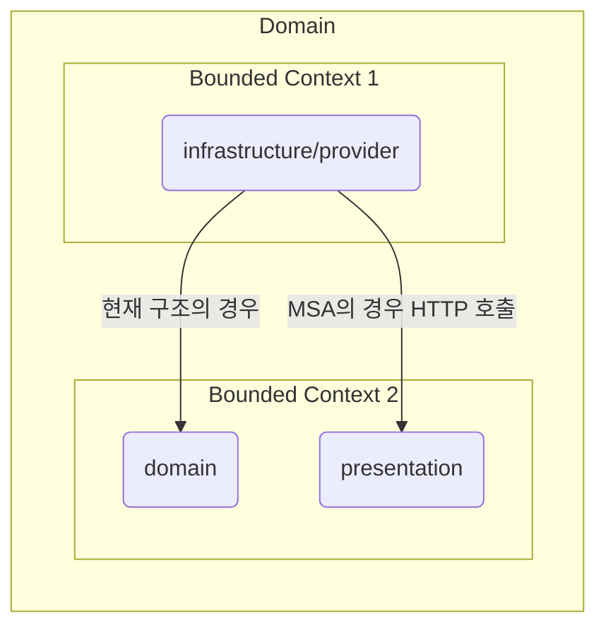
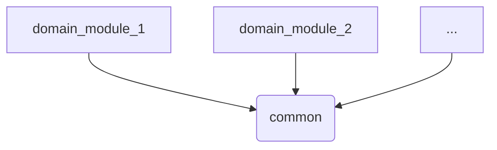
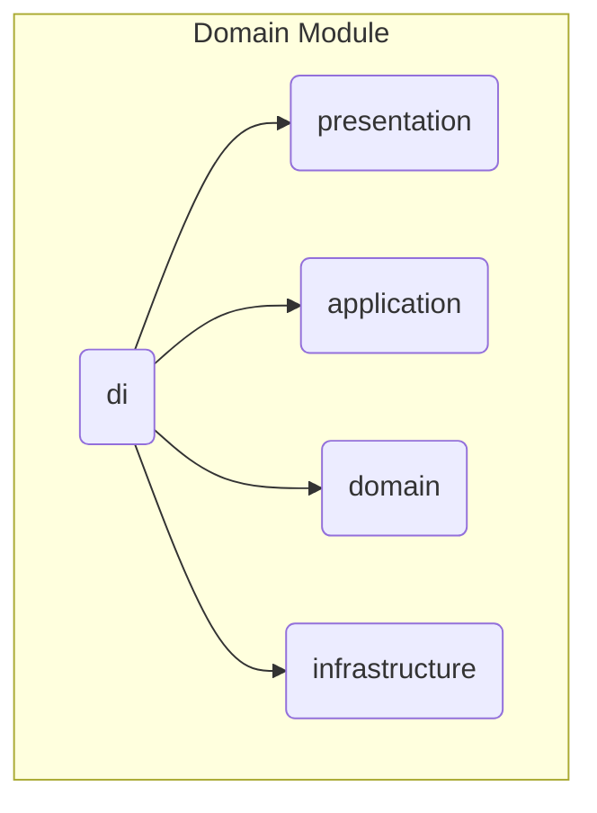

# peekr-server

# 1. Project Structure

## Clean Architecture + 도메인 별 관리

### (DDD로 점진적 리팩토링 예정)

```
project/
│
├── common/                     # 공통 계층 (모든 곳에서 참조 가능)
│   ├── di/                      # 공통 의존성 주입 계층
│   ├── jwt/                     # 공통 기능
│   ├── .../
│
├── domain/                     # 도메인 모듈들
│   ├── auth/                     # 각 도메인 모듈
│   │   └── .../
│   ├── user/                     # 각 도메인 모듈
│   │   └── .../
│   ├── post/                     # 각 도메인 모듈
│   │   ├── di/                    # 의존성 주입 계층
│   │   ├── presentation/          # 프레젠테이션 계층
│   │   ├── application/           # 애플리케이션 계층
│   │   ├── domain/                # 도메인 계층
│   │   └── infrastructure/        # 인프라스트럭처 계층
```

# 2. Project Structure Description

## Presentation Layer

### 내부 구조

- `/route`              : 라우팅 정의
- `/dto`                : 요청/응답 DTO
- `/exception`          : 프레젠테이션 공통 예외 및 핸들러
- `/util`               : 프레젠테이션 유틸
- `/api`                : 추후 필요 시 추가

### 설명 & 역할

사용자의 요청/응답을 처리하는 입구 계층

- HTTP 요청/응답 처리
- DTO 검증 등
- 추후 다른 도메인에 대해 API 제공

## Application Layer

### 내부 구조

- `/usecase`             : 유스케이스 클래스들
- `/dto`                 : 유스케이스 입력/출력 DTO (도메인 전용 DTO)
- `/service`             : 도매인 조합 흐름 관리 (optional)
- `/mapper`              : DTO <-> 도메인 매핑
- `/exception`           : 유스케이스 공통 예외 및 핸들러

### 설명 & 역할

유스케이스를 조합하고 실행하는 계층

- 유스케이스 단위 로직
- 트랜잭션 단위 설정
- 도메인 객체 생성/조합
- 리포지토리, 도메인 서비스 호출
- 외부 서비스 호출 조율 등

## Domain Layer

### 내부 구조

- `/model`               : 도메인 모델
- `/model/entity`        : 엔티티 클래스 (Ex. User.kt)
- `/model/value`         : 값 객체 (Ex. Email.kt, Password.kt)
- `/model/aggregate`     : Aggregate Root 객체
- `/repository`          : 리포지토리 인터페이스
- `/service`             : 도메인 서비스 (여러 엔티티에 걸친 복잡한 로직)

### 설명 & 역할

핵심 비즈니스 로직, 규칙, 개념을 담은 순수 계층

- 비즈니스 규칙 정의
- Entity / Value Object / Service 간 협력
- 순수 Kotlin 코드
- 핵심 모델 정의 등

## Infrastructure Layer

### 내부 구조

- `/persistence`         : ORM 기반 DB Entity (Ex. Exposed 등)
- `/repository-impl`     : 리포지토리 구현체
- `/mapper`              : 엔티티 <-> 도메인 매핑
- `/util`                : 인프라 유틸 (Ex. DB 커넥터, Parser 등)
- `/provider`            : 외부 API 클라이언트 구현체 (도메인 계층에 있는 인터페이스를 구현)

### 설명 & 역할

DB, 외부 API, 시스템 연동 등 기술 세부 구현 담당 계층

- DB 영속성 구현
- 외부 API 연동
- 메일, 메시지, Kafka 등 연동
- 도메인 인터페이스의 구현체 제공 등

# 3. Dependency Direction

## Domain, Bounded Context



## 외부 Bounded Context의 API 사용



## Common



## DI


