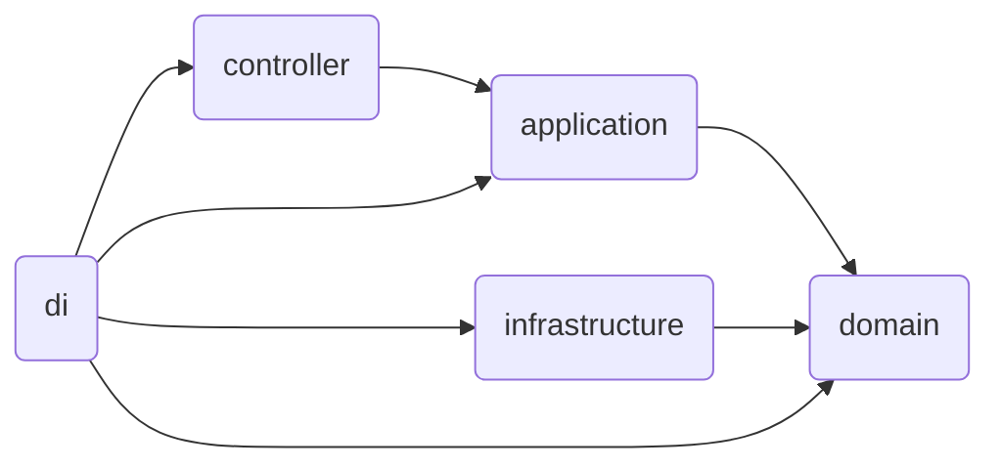

# peekr-server

## Project Structure
```
project/
├── config/                  # 설정 관련 파일들
│
├── domain/                  # 핵심 도메인 계층
│   ├── model/               # 도메인 모델
│   ├── repository/          # 리포지토리 인터페이스
│   ├── service/             # 서비스 인터페이스
│   └── event/               # 이벤트 (optional)
│
├── application/             # 애플리케이션 계층
│   ├── dto/                 # 데이터 전송 객체
│   ├── usecase/             # 유스케이스 구현 (service와 유사)
│
├── controller/                   # 프레젠테이션 계층 (라우팅)
│
├── infrastructure/          # 인프라스트럭처 계층
│   ├── entity/              # DB 엔티티
│   ├── repository-impl/     # 리포지토리 구현체
│   ├── service-impl/        # 서비스 구현체
│   ├── mapper/              # 엔티티-도메인 모델 매퍼
│   └── external/            # 외부 API 클라이언트
│
├── di/                      # 의존성 주입 설정
```
## Dependency Direction

```
controller -> application: 요청을 받고 유스케이스를 실행
application -> domain: 도메인 인터페이스 호출
infrastructure -> domain: 인터페이스 구현체 제공
di: 모든 구성요소의 의존성을 설정 (하지만 나머지 계층은 di에 의존하지 않는다.)
```