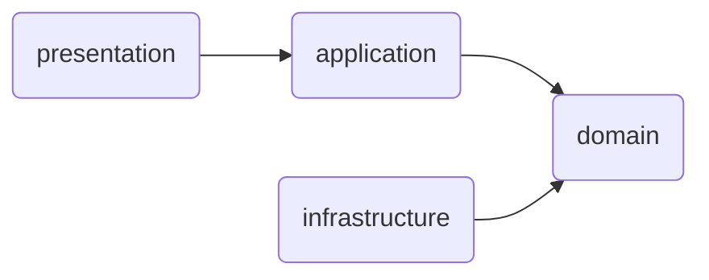
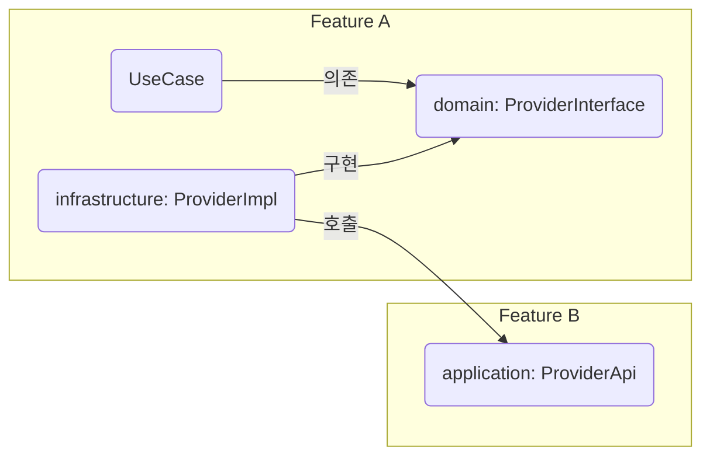

<div align="center">

# turnin-server

Turnin 앱의 API 서버


</div>

## 시작하기

**사전 준비**: JDK 17, Docker (통합 테스트용), PostgreSQL + pgvector

설정 파일(저장소에 포함되지 않음): `.env.*`, `src/main/resources/application-*.conf`, `firebase-service-account.json`, `src/main/resources/ml/` 등

```bash
./gradlew runDev
```

- 서버: `http://localhost:8080`
- Swagger UI: `/swagger`, 관리자 API는 `/swagger/admin` (운영 환경에서는 비활성)

## 명령어

| 명령어 | 설명 |
|:--|:--|
| `./gradlew runDev` | 개발 모드 실행 |
| `./gradlew build` | 빌드 + ktlint + 테스트 |
| `./gradlew test` | 전체 테스트 (`koinTest`까지 자동 실행, Docker 필요) |
| `./gradlew ktlintFormat` | 코드 스타일 자동 정리 |
| `./gradlew buildFatJar` | 배포용 `turnin-api.jar` 생성 |

## 아키텍처

패키지 기반 모듈러 모놀리스 + Clean Architecture (단일 Gradle 모듈)

```
src/main/kotlin/
├── common/              # 공통 계층 (DB, JWT, 예외, 플러그인, 배치 등). 모든 곳에서 참조 가능
└── domain/<feature>/    # 기능 모듈
    ├── di/
    ├── presentation/    # route, dto
    ├── application/     # usecase, dto, mapper, provider
    ├── domain/          # model, repository·provider 인터페이스
    └── infrastructure/  # Exposed 테이블, repository·provider 구현체
```

> `domain/seed/`는 초기 데이터 삽입 전용이다. 애플리케이션 코드에 연결하지 않는다.

| 계층 | 역할 |
|:--|:--|
| **presentation** | HTTP 요청/응답 처리, 요청 DTO 검증, API 문서(`RouteConfig.*Docs()`) |
| **application** | 유스케이스 실행, 트랜잭션 경계, DTO ↔ 도메인 매핑, 다른 기능에 제공할 API(`provider`) |
| **domain** | 엔티티·값 객체·비즈니스 규칙. 순수 Kotlin. 리포지토리/외부 API는 인터페이스로만 정의 |
| **infrastructure** | DB 영속성, 외부 시스템 연동. domain 계층의 인터페이스를 구현 |

### 의존성 방향


```mermaid
flowchart LR
    p(presentation) --> a(application) --> d(domain)
    i(infrastructure) --> d
```

- 모든 기능 모듈은 `common`을 참조할 수 있다.
- `di`는 모든 계층을 참조해 조립한다.

다른 기능의 API를 사용할 때, 유스케이스는 **자기 domain 계층의 Provider 인터페이스**에만 의존하고 infrastructure의 구현체가 상대 기능의 `application/provider`를 호출한다.


```mermaid
graph LR
    subgraph Feature A
        uc(UseCase) -- 의존 --> pi(domain: ProviderInterface)
        pimpl(infrastructure: ProviderImpl) -- 구현 --> pi
    end
    subgraph Feature B
        pac(application: ProviderApi)
    end
    pimpl -- 호출 --> pac
```

## 배포

`main`에 머지되면 GitHub Actions가 Docker 이미지를 빌드하고 서버(AWS)에 배포한다. 배포 중에는 Nginx가 점검 응답(`503`, `MTN001`)을 반환한다.

## 문서

- [CONTRIBUTING.md](CONTRIBUTING.md): 브랜치, 커밋, 코드·테스트 규칙
- [docs/spec](docs/spec): 기능 명세
- [docs/cs](docs/cs): 기술적 문제 해결 기록
