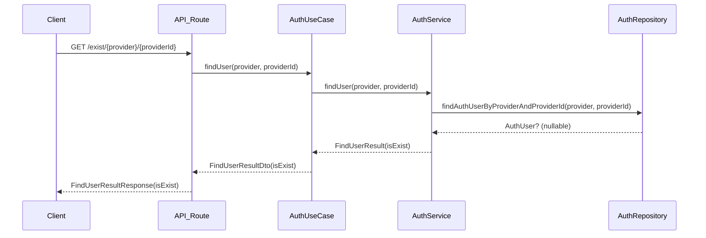

### Exist User Flow

```mermaid
sequenceDiagram
    participant Client
    participant API_Route
    participant AuthUseCase
    participant AuthService
    participant AuthRepository
    Client ->> API_Route: GET /exist/{provider}/{providerId}
    API_Route ->> AuthUseCase: findUser(provider, providerId)
    AuthUseCase ->> AuthService: findUser(provider, providerId)
    AuthService ->> AuthRepository: findAuthUserByProviderAndProviderId(provider, providerId)
    AuthRepository -->> AuthService: AuthUser? (nullable)
    AuthService -->> AuthUseCase: FindUserResult(isExist)
    AuthUseCase -->> API_Route: FindUserResultDto(isExist)
    API_Route -->> Client: FindUserResultResponse(isExist)

```